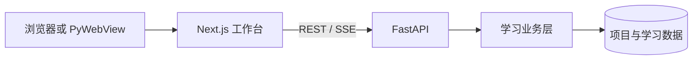
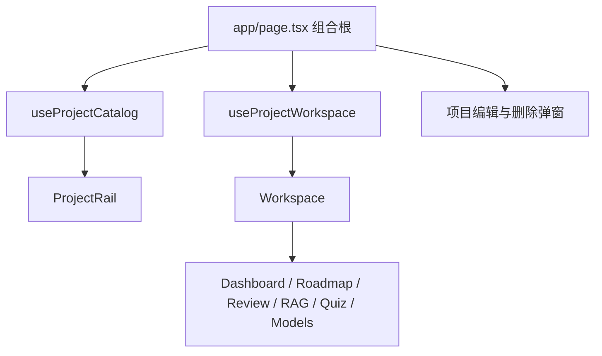
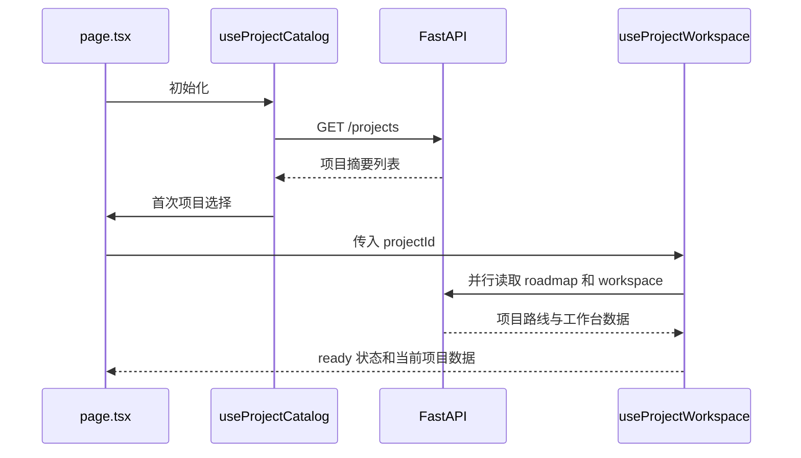
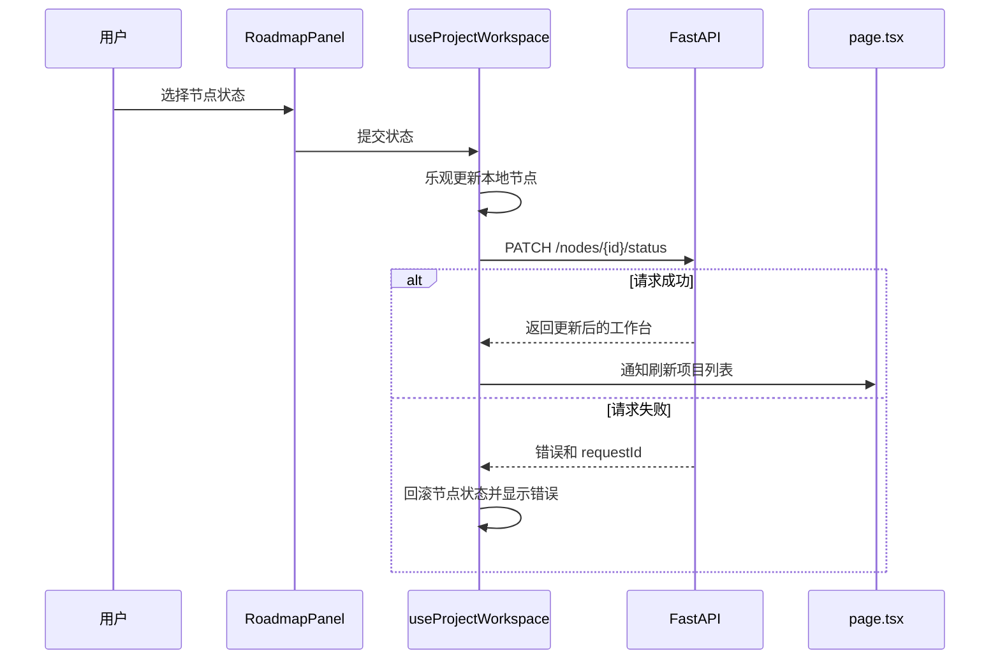
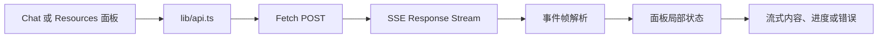

# 前端架构

本目录包含 Learn Everything 的 Next.js 学习工作台前端。前端以单页工作台承载项目选择、学习路线、节点详情、复习、问答、测验、看板和模型配置等功能。

页面使用 React Client Component 运行，业务能力按学习领域拆分到 `features/`，跨领域的请求和错误处理集中在 `lib/`。`app/page.tsx` 是组合根，只负责页面级选择状态和模块之间的协调。

## 技术栈

| 层次 | 实现 |
| --- | --- |
| Web 框架 | Next.js 16.3.3 App Router |
| UI 运行时 | React 19.2.8、React DOM 19.2.8 |
| 开发语言 | TypeScript 7.0.2，严格模式 |
| 页面模式 | 单页工作台，业务区域使用 Client Component |
| 图标 | Lucide React |
| 内容渲染 | `react-markdown`、`remark-gfm` |
| 样式 | `app/styles.css` 中的原生全局 CSS |
| HTTP 通信 | 浏览器 Fetch API |
| 流式通信 | 基于 Fetch `ReadableStream` 的 SSE |
| 构建交付 | Next.js 静态导出，由 FastAPI 同源托管 |

架构的核心做法是：让每个业务模块拥有自己的状态和异步流程，通过小而明确的接口与组合根协作；页面只组合模块，不重复实现模块内部逻辑。

## 运行时结构

开发运行时，浏览器加载 Next.js 页面，页面通过 REST 或 SSE 请求 FastAPI，FastAPI 再调用学习业务层。构建后，Next.js 生成静态页面，由 FastAPI 与 API 使用同一来源提供，浏览器或 PyWebView 负责显示页面。



PyWebView 只作为桌面窗口容器，不参与 React 渲染、前端状态管理或 API 通信。Gradio 仍是独立的兼容入口，与 Next.js 工作台共享后端业务能力，但不属于本目录的页面组合方式。

## 目录结构

```text
frontend/
├── app/                              # Next.js 页面入口和全局页面资源
│   ├── layout.tsx                    # 根布局、HTML 外壳和页面元数据
│   ├── page.tsx                      # 单页工作台组合根
│   └── styles.css                    # 全局样式、设计变量和响应式规则
├── features/                         # 按业务领域组织的前端模块
│   ├── projects/                     # 项目列表、切换和项目 CRUD
│   ├── workspace/                    # 工作台布局和项目工作台数据
│   ├── roadmap/                     # 学习路线、节点列表和节点详情
│   ├── dashboard/                   # 学习进度看板
│   ├── review/                      # 到期复习
│   ├── quiz/                        # 查漏测验
│   ├── chat/                        # RAG 流式问答
│   ├── resources/                   # 学习资料管理
│   ├── configuration/               # LLM 与 RAG 模型配置
│   └── markdown/                    # Markdown 内容渲染
├── lib/                              # 跨模块共享的请求和错误能力
│   ├── api.ts                        # DTO、REST 请求和 SSE 流封装
│   └── errors.ts                     # 统一错误格式化
└── tests/                            # 前端模块行为测试
```

各 feature 目录内部优先放置三类文件：负责展示的模块、负责状态和副作用的 hook，以及只在该业务域复用的辅助实现。跨 feature 复用的请求类型和通信逻辑放在 `lib/`，不放入某一个业务目录。

## 页面组合根

`app/page.tsx` 只维护页面级状态：

- 当前工作台视图：工作台或路线创建页；
- 当前选中的项目 ID；
- 首次加载时的项目选择；
- 项目侧栏触发的显式切换；
- 新建项目完成后的定位；
- 删除项目后的默认回退选择；
- 节点状态成功后的项目列表刷新；
- 各 feature 的组合，以及它们之间的回调连接。

项目 CRUD、工作台数据读取、节点详情操作和各 Tab 的内部交互都不在组合根中实现。组合根将这些能力连接起来，并把当前项目数据传给 `Workspace`。



## Feature 模块接口

下表描述各模块对外提供的主要接口。表中的“接口”包括组件 props、hook 返回值，以及调用方必须遵守的状态和回调约定。

| 模块 | 关键文件 | 对外接口 | 状态所有权 | 主要职责 |
| --- | --- | --- | --- | --- |
| Projects | `ProjectRail.tsx`、`ProjectEditDialog.tsx`、`ProjectDeletionDialog.tsx`、`useProjectCatalog.ts` | 侧栏接收项目集合和选择/重试/新建/编辑/删除回调；hook 接收当前项目 ID 和选择变更回调 | 项目列表、加载状态、CRUD 状态、编辑目标、删除目标 | 项目读取、创建后的列表刷新、编辑提交、删除确认和删除后的选择回退 |
| Workspace | `Workspace.tsx`、`WorkspaceStatus.tsx`、`useProjectWorkspace.ts` | hook 以项目 ID 为输入；`Workspace` 接收工作台数据、路线数据、状态和节点状态回调 | 路线与工作台数据、加载/错误状态、节点状态提交状态 | 并行加载项目数据，渲染项目头部、进度和 Tab，处理节点状态乐观更新与失败回滚 |
| Roadmap | `RoadmapPanel.tsx`、`NodeDetailPanel.tsx`、`NodeStatusControl.tsx`、`useNodeDetail.ts` | 路线面板接收路线、节点和状态更新回调；详情 hook 提供 `open`、`close`、笔记和三类生成动作 | 列表/详情视图、节点详情、笔记草稿、详情操作状态 | 展示路线阶段和节点，进入/返回详情，生成课程/实操/资料，保存笔记 |
| Dashboard | `DashboardPanel.tsx` | `projectId` | 看板请求和导出状态 | 读取并展示项目学习进度、统计和导出入口 |
| Review | `ReviewPanel.tsx` | `projectId` | 到期卡片和评分状态 | 读取到期卡片并提交复习评分 |
| Quiz | `QuizPanel.tsx` | `projectId`、节点列表 | 测验生成、答题和反馈状态 | 选择知识点、生成测验、提交答案并展示掌握度反馈 |
| Chat | `RagChatPanel.tsx` | 当前节点或资料范围 | 会话历史、流式回答、引用和连接状态 | 通过 SSE 展示 RAG 问答过程和引用 |
| Resources | `ResourceLibraryPanel.tsx` | 当前节点列表 | 上传、索引、资料删除和进度状态 | 管理资料上传、索引进度、资料列表和删除确认 |
| Configuration | `ModelConfigurationPanel.tsx` | 无业务参数，直接使用配置请求 | LLM/RAG 配置档案、保存和连通性测试状态 | 管理两类模型配置及其档案生命周期 |
| Markdown | `MarkdownContent.tsx` | Markdown 字符串 | 无异步状态 | 统一渲染课程、实操课程和其他 Markdown 内容 |

## 状态与回调所有权

页面状态按离用户意图最近的模块归属：

| 状态 | 所属模块 | 协作方式 |
| --- | --- | --- |
| 当前 Tab、当前项目 ID | `app/page.tsx` | 通过 props 和回调驱动子模块 |
| 项目列表和项目 CRUD | `useProjectCatalog` | 组合根消费刷新结果并决定当前项目 |
| 路线与工作台数据 | `useProjectWorkspace` | 项目 ID 变化时重新加载 |
| 节点详情、笔记草稿和详情操作 | `useNodeDetail` | 路线面板调用打开、关闭和生成动作 |
| 节点状态本地值和提交状态 | `useProjectWorkspace` / `RoadmapPanel` | 先乐观更新，失败时恢复原状态 |
| 看板、复习、测验和问答交互 | 各自面板 | 面板内部读取 API 并维护局部状态 |

跨模块更新使用显式回调完成。例如节点状态提交成功后，工作台 hook 调用组合根传入的刷新回调，使项目侧栏重新读取进度；项目侧栏不会直接修改工作台内部状态。

## API 与数据流

`lib/api.ts` 集中维护前端 DTO、API 地址拼接、JSON 请求、SSE 响应解析和 `ApiError`。业务模块只调用这些已命名的请求函数，不直接拼接重复的请求处理逻辑。

### 页面初始化与项目切换



### 节点状态更新



### 节点详情操作

```mermaid
flowchart LR
    List[路线节点列表] -->|open(nodeId)| DetailHook[useNodeDetail]
    DetailHook -->|GET| NodeAPI[节点详情 API]
    NodeAPI --> Detail[NodeDetailPanel]
    Detail -->|生成课程 / 实操 / 资料| DetailHook
    Detail -->|保存笔记| DetailHook
    DetailHook -->|更新 detail 或 actionError| Detail
```

### SSE 流式通信

RAG 问答和资料上传使用 POST 请求建立流式响应。`lib/api.ts` 读取 `ReadableStream`，按事件帧解析 `event` 与 `data`，再把结构化事件交给对应面板更新局部状态。



## 错误处理

普通 JSON 请求失败时，`lib/api.ts` 抛出 `ApiError`，其中包含 HTTP 状态、后端消息和可选的 `requestId`。各模块通过 `lib/errors.ts` 将异常转换为用户可读的中文提示，并在自己的状态区域展示。

节点详情操作还区分两类错误：

- 读取详情失败：由详情加载状态展示，当前详情不可用；
- 生成或保存失败：保留已有详情内容，只显示操作错误，不覆盖其他窗口。

异步读取使用请求编号忽略过期响应，避免快速切换节点或项目时旧响应覆盖当前界面。

## 前端与兼容入口的关系

Next.js 工作台和 Gradio 页面是两个独立的前端入口：

- Next.js 入口提供当前默认的单页学习工作台；
- Gradio 入口保留旧的兼容交互；
- 两者共享后端学习能力和数据，但不共享 React 组件、页面状态或路由；
- `frontend/` 下的模块化架构只描述 Next.js 工作台。

## 架构边界

当前前端架构有以下稳定边界：

- 页面是单页工作台，Tab 由组件状态切换；
- `app/page.tsx` 只承担页面级选择和跨模块协调；
- 业务状态和副作用由所属 feature 管理；
- API DTO 与通信实现集中在 `lib/api.ts`；
- 通用错误格式化集中在 `lib/errors.ts`；
- feature 之间通过参数和回调通信，数据写入由对应业务模块发起；
- 节点详情、路线列表和工作台共享当前项目上下文，但各自保持清晰的状态所有权。
